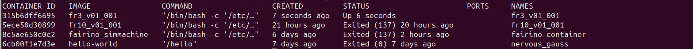

# Run Custom Docker Image

This guide explains how to download, extract, and run the appropriate Docker image for your robot model.

---

## 1. Download the Suitable Tar File

Choose the tar file based on your robot version:


- **FR10 Model** ⇒ `fr10_v01_001.tar.gz`
- **FR3 Model** ⇒ `fr3_v01_001.tar.gz`
- **FR20 Model** ⇒ `fr20_v01_001.tar.gz`
- [Download from Google Drive](https://drive.google.com/drive/folders/1H9e09kq_9LHEltpWT7LXSCKwEqdkc23f?)


---
👉 **Note:** For each command you will have to replace `(v)` in the filenames/commands with your robot model (e.g., `fr3`, `fr5`, `fr10`).  

## 2. Extract the File

Unzip the downloaded file:

```bash
gunzip fr(v)_v01_001.tar.gz
```

after replacing the command your final code will look like 
```bash
gunzip fr3_v01_001.tar.gz
```

---

## 3. Load the Docker Image

(Assuming Docker is already installed on your machine)

```bash
sudo docker load -i fr(v)_v01_001.tar
```

---

## 4. (You can Skip this if you already have fairino-net network) Create a Docker Network

If you do not already have a network named **fairino-net**, create one:

```bash
sudo docker network create --driver bridge --subnet 192.168.58.0/24 --gateway 192.168.58.1 fairino-net
```

---

## 5. Run the Docker Container

Run the loaded image for the first time using the following command.  
This ensures that the image is properly connected to the network (assuming **fairino-net** is set up):

```bash
sudo docker run -d -P --name fr(v)_v01_001 --privileged -u root --net fairino-net fr(v)_v01_001
```

---

## 6. Validate the Container

Check that the container is running properly:

```bash
sudo docker ps -a
```

You should see all running instances, with `fr3` actively running.



---

## 7. Verify Robot Version

Open the **WebAPP** → Navigate to **System ⇒ About**  
Ensure the **robot model** aligns with the **Docker image** you installed.


---


